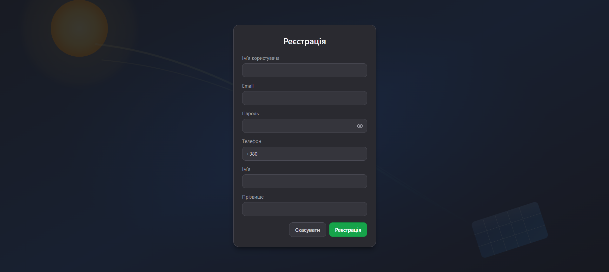
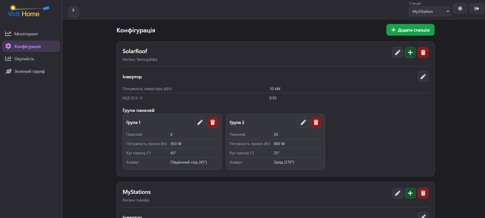
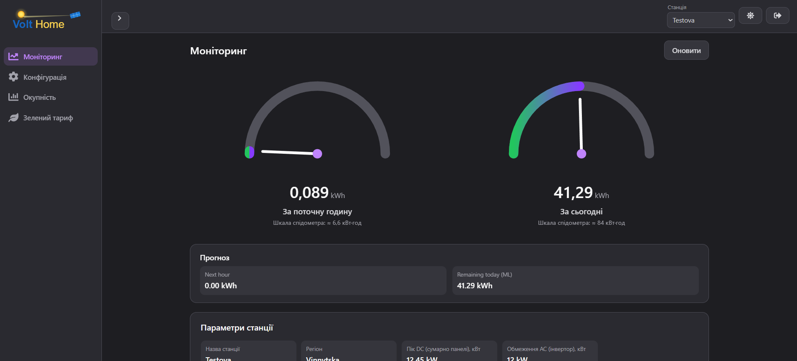
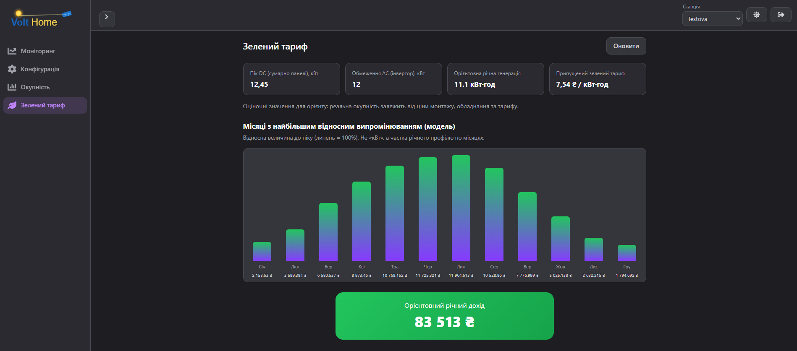

# VoltHome

VoltHome is a solar station monitoring and energy forecasting platform.
It combines a modern React + TypeScript frontend with an ASP.NET Core backend, PostgreSQL database, and ML.NET forecasting.

---

## 🚀 What this project does

- Manages solar power stations and their equipment
- Tracks real-time solar energy generation and daily production
- Forecasts short-term energy output using machine learning
- Calculates financial metrics such as green tariff revenue and payback period
- Supports secure authentication, authorization, and multi-station management

---

## 🧩 Technology stack

- Frontend: React, TypeScript, Vite
- Backend: ASP.NET Core 8, Entity Framework Core, ASP.NET Identity
- Database: PostgreSQL
- Machine learning: ML.NET
- Authentication: JWT
- API docs: Swagger / OpenAPI

---

## 📁 Project structure

- `backend/VoltHome.API` — ASP.NET Core API and authentication
- `backend/VoltHome.Services` — business logic and forecasting services
- `backend/VoltHome.Infrastructure` — database context, repositories, migrations
- `backend/VoltHome.Domain` — domain models and entity classes
- `backend/VoltHome.Contracts` — request/response contracts and DTOs
- `frontend` — React + TypeScript user interface

---

## 🛠️ Getting started

### Prerequisites

- .NET 8 SDK
- PostgreSQL
- Node.js (for frontend)

### Backend setup

1. Open `backend/VoltHome.API/appsettings.json`
2. Update the PostgreSQL connection string:

```json
"ConnectionStrings": {
  "DefaultConnection": "Host=localhost;Port=5440;Database=volt-home;Username=postgres;Password=1111"
}
```

3. Apply database migrations:

```bash
dotnet ef database update --project backend/VoltHome.API --startup-project backend/VoltHome.API
```

4. Run the backend:

```bash
cd backend/VoltHome.API
dotnet run
```

### Frontend setup

1. Install dependencies:

```bash
cd frontend
npm install
```

2. Start the frontend:

```bash
npm run dev
```

---

## 🔐 Default accounts

- Admin
  - Email: internalAdmin@gmail.com
  - Password: Qwerty123$

- Test user
  - Email: john@example.com
  - Password: Test123$

---

## 📖 API documentation

Open Swagger UI in the browser after running the backend:

```text
https://localhost:<port>/swagger
```

---

## 📸 Screenshots

Login screen:



Solar station configuration:



Monitoring dashboard:



Green tariff calculations:


